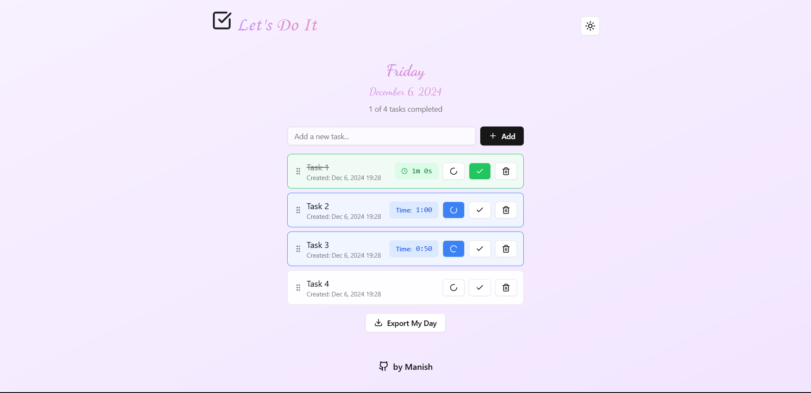

# [TickMARK](https://tickmark.netlify.app/)

Welcome to **TickMark**, a simple yet powerful To-Do List program that helps you manage your tasks efficiently. With this application, you can create, manage, and export your daily tasks seamlessly.

## Features

- **Create Tasks**: Easily add new tasks to your list.
- **Task Management**: Mark tasks as "Working" or "Completed".
- **Delete Tasks**: Remove tasks that are no longer needed.
- **Rearrange Tasks**: Organize your tasks in the order you prefer.
- **Daily Summary Export**: Download a snapshot of your daily tasks for easy reference.
- **Dark and Light Mode**: Enjoy a user-friendly interface with both dark and light themes.

## Screenshots

<a href="https://tick-mark.vercel.app/">
    
</a>

<a href="https://tick-mark.vercel.app/">
    
</a>


*Click the images to view the project in action!*

## Live Demo

You can try out the application on the following platforms:

- [Netlify](https://tickmark.netlify.app/)
- [Vercel](https://tick-mark.vercel.app/)

## Getting Started

To get a local copy up and running, follow these steps:

1. Clone the repository:
   ```bash
   git clone https://github.com/Adarsh3321/TickMark.git
   ```
2. Navigate to the project directory:
   ```bash
   cd TickMark
   ```
3. Install the dependencies:
   ```bash
   npm install
   ```
4. Start the application:
   ```bash
   npm start
   ```

## Contributing

Contributions are welcome! Please feel free to submit a pull request or open an issue for any suggestions or improvements.

## Acknowledgments

- Thanks to all the contributors and the open-source community for their support.
```

